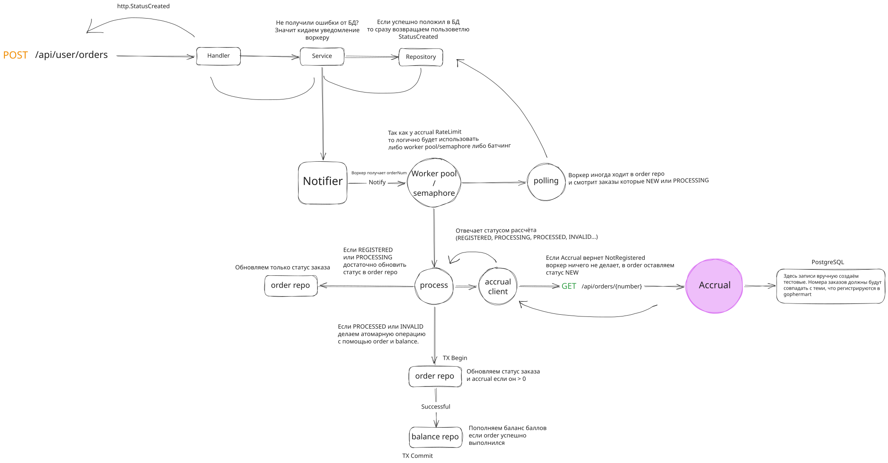

# Worker

Worker — фоновый обработчик заказов, который отвечает за получение актуального статуса заказа из accrual-сервиса, обновление состояния заказа и начисление баллов пользователю.

Worker запускает обработку заказов двумя способами:

- через `Notify` — после успешного создания нового заказа;
- через периодический polling — получение из базы заказов со статусами `NEW` и `PROCESSING`.

После получения заказа Worker отправляет запрос в accrual-сервис и обрабатывает результат:

- `NOT_REGISTERED` — заказ ещё не найден в accrual, обработка откладывается до следующей проверки;
- `REGISTERED` и `PROCESSING` — заказ переводится в состояние `PROCESSING`;
- `PROCESSED` — сохраняется итоговый статус и начисляются баллы пользователю;
- `INVALID` — заказ помечается как некорректный.

Для ограничения нагрузки используется semaphore, который ограничивает количество одновременно обрабатываемых заказов.

Финальное обновление заказа и начисление баллов выполняются в рамках одной транзакции. Перед начислением проверяется результат атомарного обновления заказа, поэтому повторная обработка одного заказа не приводит к повторному начислению баллов.

Схема работы Worker:

