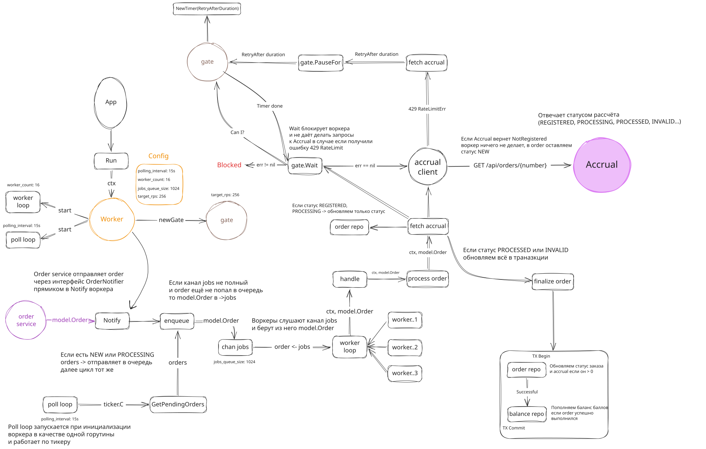

# Worker



Worker отвечает за синхронизацию заказов Gophermart с внешней системой **Accrual**.

Его задачи:

* получать новые заказы на обработку;
* периодически проверять необработанные заказы;
* запрашивать актуальный статус заказа у Accrual;
* обновлять статус заказа;
* начислять бонусные баллы после успешного расчёта;
* ограничивать нагрузку на Accrual и корректно обрабатывать `429 Too Many Requests`.

---

# Общая схема

Существует два независимых источника появления заказа:

1. **Notify()**

   * вызывается сервисом заказов сразу после успешного сохранения нового заказа;
   * позволяет начать обработку без ожидания очередного polling.

2. **Polling**

   * периодически запрашивает из БД заказы со статусами `NEW` и `PROCESSING`;
   * гарантирует, что заказ будет обработан даже после рестарта приложения или если уведомление было потеряно.

Оба источника используют общий путь обработки.

```text
Notify() ─┐
          │
          ▼
       enqueue()
          ▲
          │
 PollLoop() ───── GetPendingOrders()
          │
          ▼
       jobs channel
          ▼
     worker goroutines
          ▼
     processOrder()
```

---

# Очередь обработки

Перед помещением заказа в очередь используется `inflight`.

```go
sync.Map
```

Он содержит номера заказов, которые уже находятся в обработке или ожидают своей очереди.

Это позволяет избежать ситуации, когда один и тот же заказ одновременно попадёт в несколько воркеров.

Если очередь заполнена, заказ не теряется.

Он будет повторно найден polling-процессом при следующем проходе.

---

# Worker Pool

При запуске создаётся фиксированное количество воркеров.

```text
jobs
 │
 ├── worker #1
 ├── worker #2
 ├── worker #3
 └── ...
```

Каждый воркер:

1. получает заказ из канала;
2. вызывает `processOrder()`;
3. после завершения освобождает запись из `inflight`.

---

# Обработка заказа

Вся логика сосредоточена в `processOrder()`.

Порядок работы:

1. игнорируются уже завершённые заказы (`PROCESSED`, `INVALID`);
2. выполняется запрос в Accrual;
3. анализируется полученный статус;
4. при необходимости обновляется состояние заказа;
5. если расчёт завершён — выполняется транзакция начисления бонусов.

---

# Обработка статусов Accrual

| Статус Accrual   | Действие                              |
| ---------------- | ------------------------------------- |
| `NOT_REGISTERED` | ничего не делать, оставить `NEW`      |
| `REGISTERED`     | перевести заказ в `PROCESSING`        |
| `PROCESSING`     | оставить `PROCESSING`                 |
| `PROCESSED`      | завершить заказ и начислить бонусы    |
| `INVALID`        | завершить заказ со статусом `INVALID` |

---

# Финализация заказа

Когда Accrual возвращает конечный статус (`PROCESSED` или `INVALID`), выполняется одна транзакция.

```text
BEGIN

UpdateOrderResult()

↓

AccrueBalance()

↓

COMMIT
```

Если начисление баллов завершилось ошибкой, транзакция откатывается.

Таким образом невозможно получить ситуацию, когда заказ уже отмечен как обработанный, но баланс пользователя не обновился.

---

# Gate

Все HTTP-запросы к Accrual проходят через компонент `gate`.

```text
Worker

↓

gate.Wait()

↓

Accrual Client

↓

Accrual
```

Gate выполняет две задачи:

* ограничивает скорость запросов (`rate.Limiter`);
* координирует работу всех воркеров после получения `429 Too Many Requests`.

---

# Обработка 429 Too Many Requests

Если Accrual возвращает

```http
429 Too Many Requests
Retry-After: N
```

воркер вызывает

```go
gate.PauseFor(retryAfter)
```

После этого:

* запоминается момент окончания паузы;
* все новые запросы к Accrual блокируются в `gate.Wait()`;
* polling также временно прекращает обращения к БД, так как обработка новых заказов всё равно невозможна.

Это предотвращает лавинообразные повторные запросы и позволяет строго соблюдать требования внешнего API.

---

# Плавный прогрев (Warm-Up)

После окончания паузы Gate не выпускает сразу все ожидающие запросы.

Вместо этого используется постепенное увеличение допустимого количества запросов.

Схематично:

```text
429

↓

Pause

↓

5% RPS

↓

20%

↓

40%

↓

60%

↓

100%
```

Во время прогрева:

* burst ограничивается до `1`;
* лимит запросов плавно увеличивается до целевого значения;
* после завершения прогрева восстанавливаются исходные параметры `rate.Limiter`.

Такой подход позволяет избежать резкого всплеска нагрузки сразу после окончания `Retry-After`.

---

# Защита от гонок

Даже если один и тот же заказ оказался одновременно обработан двумя воркерами (например, после polling и Notify), окончательная защита реализована на уровне базы данных.

Метод

```go
UpdateOrderResultTx(...)
```

атомарно обновляет заказ только если он ещё не был финализирован.

Если другой воркер уже успел выполнить обновление, метод возвращает `updated = false`, и текущая обработка завершается без повторного начисления бонусов.

Таким образом начисление баллов остаётся идемпотентным.

---

# Graceful Shutdown

Все горутины работают с общим `context.Context`.

При завершении приложения:

* polling прекращает работу;
* воркеры перестают получать новые задания;
* `WaitGroup` ожидает завершения всех активных обработок;
* приложение завершается только после корректного окончания работы всех воркеров.
